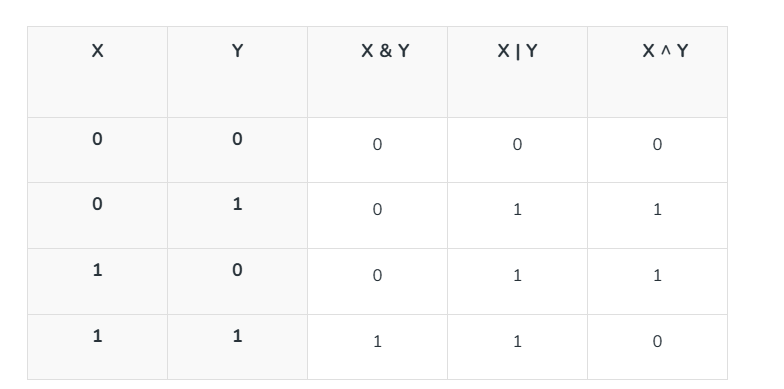
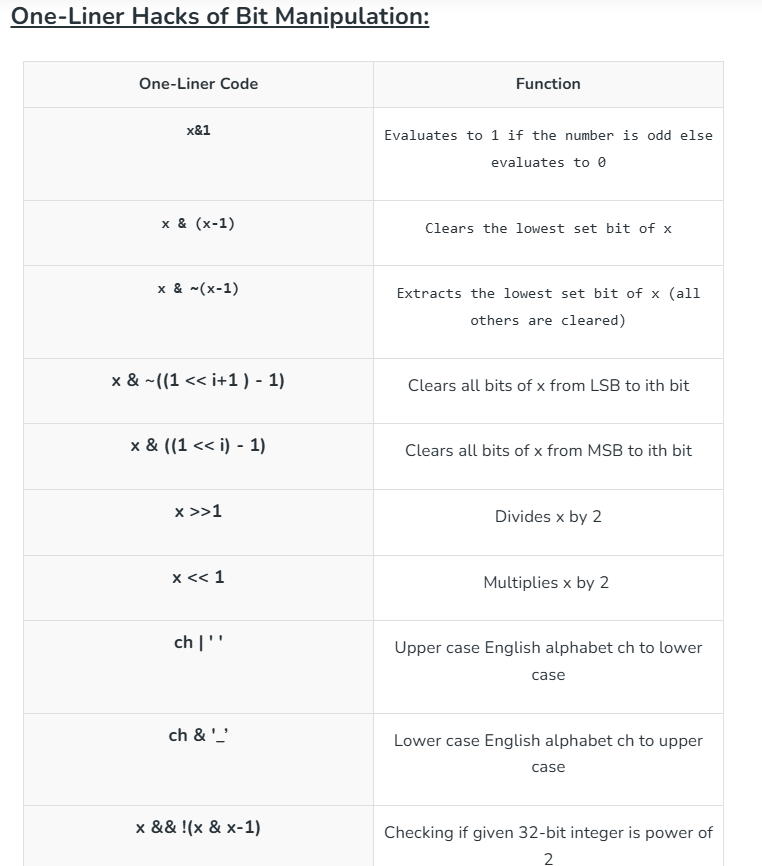

 ==== Bitwise Operators ====

1. & (bitwise AND)  : result of AND is 1 only if both bits are 1.
2. | (bitwise OR) 	: result of OR is 1 if any of the two bits is 1.
3. ^ (bitwise XOR)  : result of XOR is 1 if the two bits are different.
4. << (left shift)  : the left shifts the bits of the first operand, and the second operand decides the number of places to shift.
5. ,>> (right shift) : the right shifts the bits of the first operand, and the second operand decides the number of places to shift.
6. ~ (bitwise NOT)  : takes one number and inverts all bits of it.

Interesting Facts About Bitwise Operators :

**Shift Operators:**

    n = n >> 1; // divide by 2
    n = n << 1; // multiply by 2

**Bitwise XOR (^)**:

Very useful in programming problems. For example, finding the odd occurring number in a set where all other numbers occur even times can be done efficiently using XOR.

    XOR of a number with itself is 0 .       i.e. x ^ x = 0
    And XOR of a number with 0 is number.    i.e. 0 ^ x = x
    
          1-n     : 1, 2, 3, 4, 5
         array   :  1, 2,    4, 5     XOR
      --------------------------------
                    0, 0, 3, 0, 0

**Check Odd/Even:**

The AND operator (&) can quickly check if a number is odd or even. (x & 1) is non-zero if x is odd, and 0 if even.

    Is the number odd?  -> Odd numbers end with 1 in binary (last bit will be 1)
    & 1 checks the last bit
    5  -> 101 & 001 = 1 -> odd
    4  -> 100 & 001 = 0 -> not odd, means even
    Now doing  (n & 1), will give me 0/1, which I can use to decide odd or even

**Negative representation of a number in binary:**

    => In Java (and most languages), negative numbers are stored in two’s complement form.
    => -num  = ~num + 1 (bitwise NOT plus 1)
    +num = +5,               0000 0101
    -num = -5, => ~num + 1   => 1111 1010 + 1 => 1111 1011 // this is -5 in two’s complement

**Get the rightmost set bit(i.e. 1) from n:**

    formula to get the rightmost set bit of a num        =>     num = num & -num

        num     = 1 0 1 0 1 0 0
       -num     => ~num + 1 => 0 1 0 1 0 1 1 + 1 => 0 1 0 1 1 0 0
       
        num     = 1 0 1 0 1 0 0
       -num     = 0 1 0 1 1 0 0
       ----------------------------
       &          0 0 0 0 1 0 0 => we get the rightmost-set bit

    n = +12 	            ->	 1100
    n = -12 =  ~n + 1       ->	 0011 + 1   ->  0100

    n = +12     ->	 1100
    n = -12     ->	 0100
            ---------------
    AND         ->	 0100
    rightmost set bit is now set to 1, everything else is set to 0

**Count set bits in an integer**

Counting number of 1s in the binary representation of a number

    private static int countSetBits(int n) {
        int count = 0;
        while (n > 0) {
            n = n & (n-1); // this removes the rightmost set bit from n
            count++;
        }
        return count;
    }

https://www.geeksforgeeks.org/dsa/introduction-to-bitwise-algorithms-data-structures-and-algorithms-tutorial/
https://www.geeksforgeeks.org/competitive-programming/bit-tricks-competitive-programming/

 == Get the frequency / count of a number in n array - 2 nested loop / hashMap == 

        for (int i = 0; i < n; i++) {
            int candidate = arr[i]; // selected element
            int cnt = 0;

            //find the occurrence using linear search:
            for (int j = 0; j < n; j++) {
                if (arr[j] == candidate)
                    cnt++;
            }

            // if the occurrence is 1 return ans:
            if (cnt == 1)
                return candidate;
        }

    Element is used as key and the frequency is used as the value 
    HashMap<Integer, Integer> map = new HashMap<>();
    for (int curr : arr) {
        map.put(curr, freq.getOrDefault(curr, 0) + 1);
    }
    
